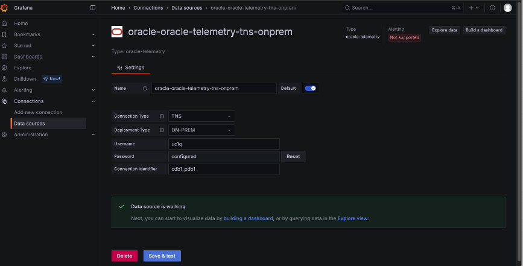
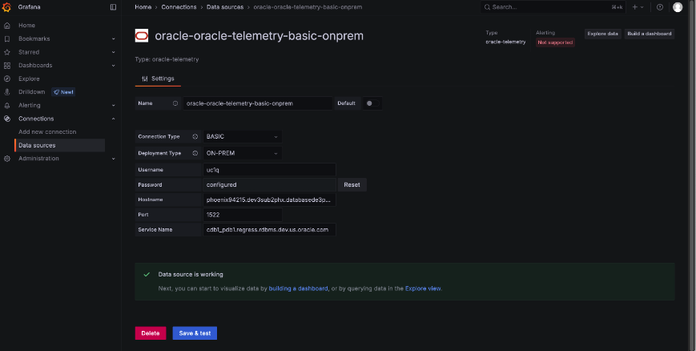
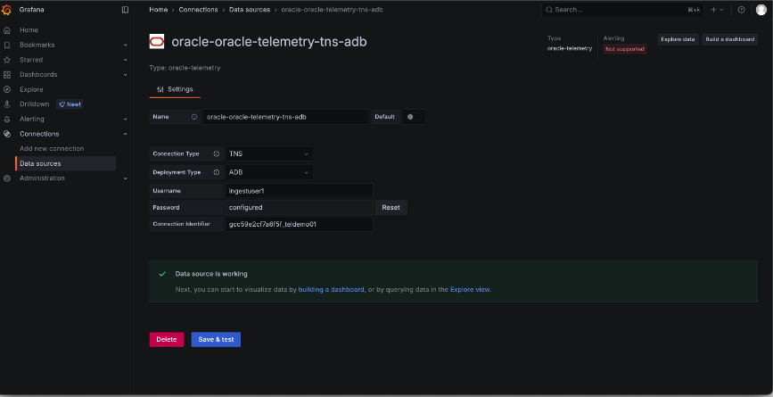
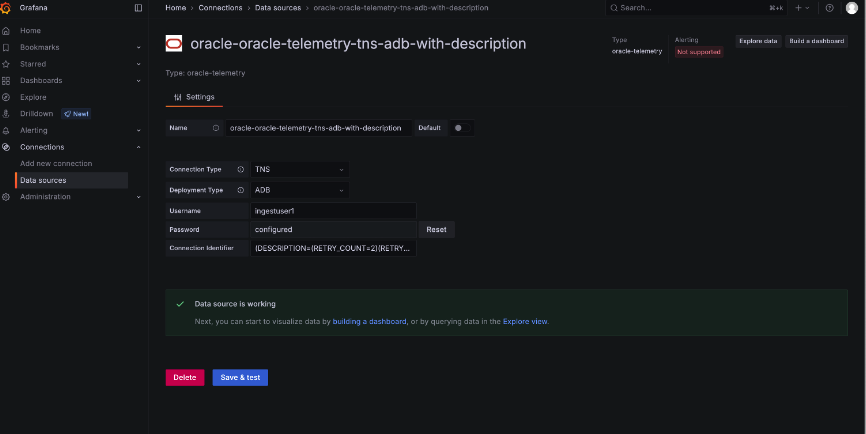
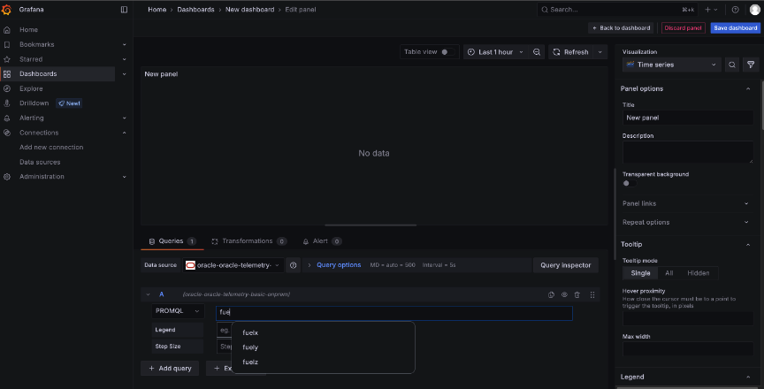
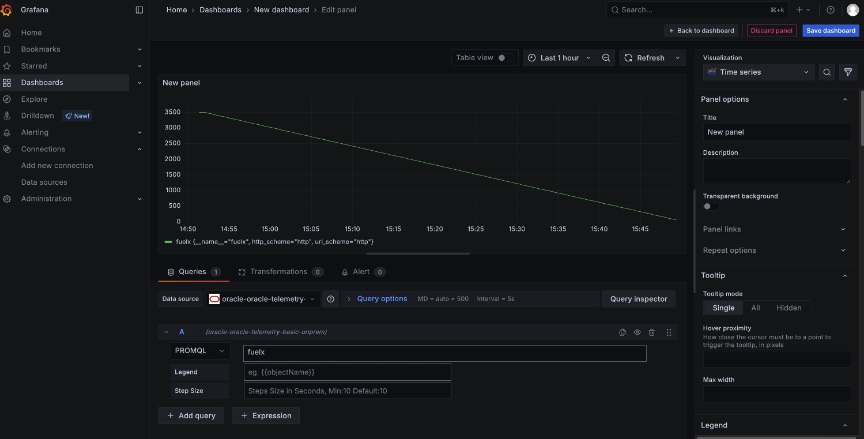
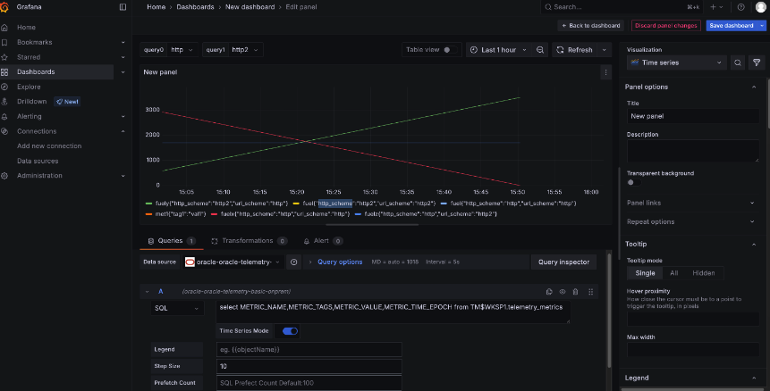

# Oracle Telemetry Grafana Plugin – Architecture & Security Overview

This document describes the architecture, data flow, trust boundaries, security model, and operational flow of the Oracle Telemetry Grafana Plugin.

It is intended to provide transparency into how the plugin operates and to support internal and external security review.

---

# 1. Context

This Grafana plugin connects to an Oracle Database in order to query and visualize telemetry data.

The plugin primarily interacts with Oracle Telemetry PL/SQL APIs, which are documented and secured as part of the Oracle Telemetry product. In addition, the plugin supports execution of user-provided SQL queries, subject to the privileges of the database user configured for the datasource.

This document focuses on:

- Architecture and component responsibilities  
- Trust boundaries  
- Secure handling of user input and credentials  
- Query execution model  
- Security assumptions and limitations  

---

# 2. High-Level Architecture & Trust Boundaries

## Architecture Overview

.png)

### Components

### 1. Grafana UI (Frontend – Browser)
- QueryEditor (React TSX)
- ConfigEditor (React TSX)
- Datasource configuration UI
- VariableQueryEditor

Runs in the user’s browser and is treated as **untrusted input**.

---

### 2. Grafana Backend Plugin (Go Binary)
- Input validation
- SQL / PL-SQL execution
- Error sanitization
- Secure credential usage

Runs inside the Grafana server and is treated as a **trusted execution layer**.

---

### 3. Oracle Database
- Oracle Telemetry PL/SQL APIs
- User-provided SQL execution
- Database privilege enforcement
- Authentication & auditing

The Oracle Database is the **policy enforcement point**.

---

## Trust Model

| Component | Trust Level | Description |
|------------|-------------|------------|
| Frontend | Untrusted | User-controlled browser environment |
| Backend | Trusted | Runs within Grafana server |
| Oracle Database | Trusted | Enforces database-level security |

---

## Key Security Rule

**The frontend never communicates directly with the Oracle Database.**

All database access is performed exclusively by the backend Go plugin running inside Grafana.

---

# 3. Datasource Configuration Screenshots

## Adding the Plugin as a Datasource

The plugin appears as `oracle-telemetry` in the Grafana "Add data source" page.  
Unsigned plugin loading must be enabled for development environments.

---

## TNS Connection – On-Prem Deployment

This configuration uses:

- Connection Type: TNS  
- Deployment Type: ON-PREM  
- Username / Password  
- TNS Connection Identifier  

Connectivity is validated using the **Save & Test** button.

---

## BASIC Connection – On-Prem Deployment

This configuration uses:

- Hostname
- Port
- Service Name
- Username / Password

Used when direct host-based connection is preferred over TNS.

---

## TNS Connection – Autonomous Database (ADB)

Used for Oracle Autonomous Database connections via TNS identifier.

---

## TNS Connection – ADB with Description String

Allows full Oracle DESCRIPTION-based connection strings for advanced connection scenarios.

---

# 4. Data Flow (Security View)

1. User provides input in Query Editor.
2. Frontend sends structured request to backend.
3. Backend:
   - Validates input
   - Retrieves encrypted credentials from Grafana
   - Establishes Oracle DB connection using `godror`
   - Executes:
     - Approved Telemetry PL/SQL APIs, or
     - User-provided SQL
4. Oracle Database enforces privilege checks.
5. Backend sanitizes results and returns JSON.
6. Frontend renders results in Grafana panels.

---

## Key Security Guarantees

- Credentials are never exposed to the browser.
- SQL is executed only in the backend.
- The frontend cannot access database directly.
- Database-level security remains authoritative.

---

# 5. Query Execution Modes

## PromQL-style Query (Telemetry API)

The Query Editor supports controlled metric selection with autocomplete.

---

Telemetry-style queries are mapped internally to Oracle Telemetry PL/SQL APIs.  
Business logic enforcement remains inside Oracle Database.

---

## SQL Query Mode

Users may execute explicit SQL queries.

Security model:

- SQL runs only in backend.
- Execution privilege depends entirely on configured database user.
- No SQL rewriting or sandboxing is performed.

---

# 6. Database Access & Query Restrictions

The plugin supports two modes:

### 1. Oracle Telemetry PL/SQL APIs
- Controlled, documented APIs
- Business logic encapsulated in DB
- Security enforced at DB layer

### 2. User-Provided SQL
- Executed in backend only
- Privilege determined by datasource user
- Plugin does not implement SQL filtering

---

## Security Implications

If a highly privileged database user (e.g., DBA) is configured, the plugin executes at that privilege level.

This design assumes:

- Least-privilege datasource configuration
- Restricted Grafana administrative access

---

# 7. Credential & Secret Handling

- Credentials configured in Grafana datasource
- Stored using `secureJsonData`
- Encrypted at rest
- Decrypted only at runtime in backend
- Never exposed to frontend
- Never logged

The plugin does not implement custom secret management.

Security of credential storage relies entirely on Grafana’s server-side security model.

---

# 8. Frontend Security Controls

The frontend:

- Does not execute SQL
- Does not access database directly
- Does not call external services
- Sends structured requests only

User input is collected via controlled UI elements such as dropdowns and validated fields.

---

# 9. Backend Security Controls

The backend:

- Validates requests
- Executes database logic
- Sanitizes returned errors
- Logs operational details server-side only

---

# 10. Testing & Validation

## Frontend
- TypeScript unit tests
- Executed via `yarn test`
- ~80% coverage

## Backend
- Go unit tests
- ~75% coverage
- Covers query paths and error handling

## Manual Testing
- End-to-end validation via Grafana UI
- Datasource connectivity testing
- Query rendering validation

---

# 11. Assumptions & Limitations

## Operational Assumptions

- Oracle Client libraries securely installed
- Grafana server securely operated
- Datasource users follow least-privilege principle
- Oracle Database privilege model properly configured

## Limitations

- Plugin does not restrict SQL executed by trusted users
- Plugin does not protect against malicious Grafana administrators
- Plugin does not override database privilege enforcement

---

# Appendix – Code Quality & Static Analysis

The backend is validated using:

- Go unit tests
- Static analysis tools
- Oracle Parfait (for Go)

These tools help maintain code quality and detect potential issues.
